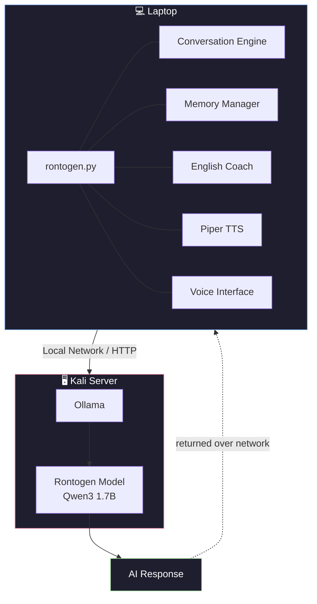
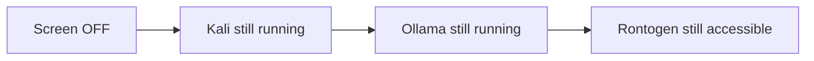
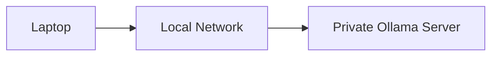
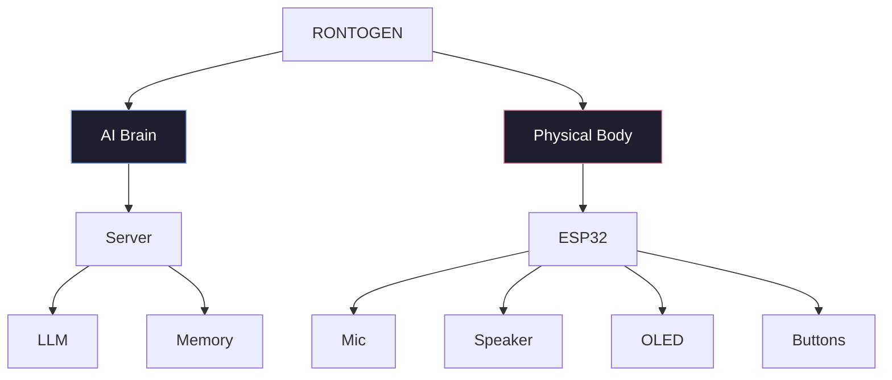
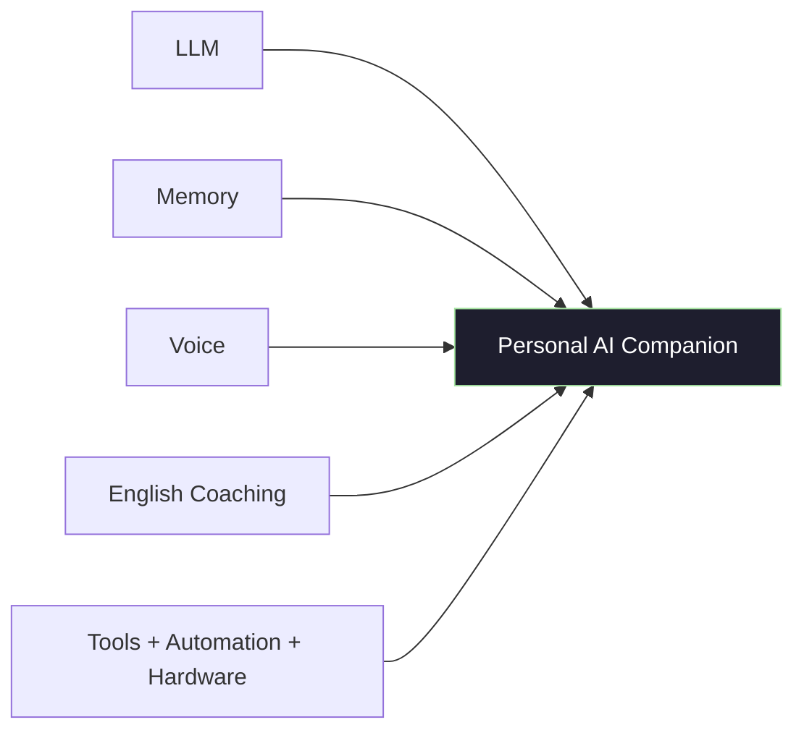

<div align="center">

# 🤖 Rontogen

### A Private, Customizable Personal AI Companion

*A local AI that talks, listens, remembers, helps with studies — and one day, has a body.*


</div>

---

## 📖 Table of Contents

- [Overview](#-overview)
- [Current Architecture](#-current-architecture)
- [Features](#-features)
- [Project Structure](#-project-structure)
- [Requirements](#-requirements)
- [Running Rontogen](#-running-rontogen)
- [Security & Privacy](#-security--privacy)
- [Future Development](#-future-development)
- [Hardware Vision](#-hardware-vision)
- [Development Philosophy](#-development-philosophy)
- [Current Status](#-current-status)
- [Author](#-author)

---

## 🧭 Overview

Rontogen is built around one simple idea:

> A personal AI that can talk, listen, remember useful information, help with studies and projects, and eventually have a physical body.

The current version runs as a **laptop-based interface**, while the AI brain runs separately on a **Kali Linux inference server** — a client/server split that keeps the interface lightweight and the heavy lifting on dedicated hardware.

---

## 🏗️ Current Architecture



The laptop acts as the main Rontogen interface, while the Kali PC provides the AI inference server.

**Network path:**

```text
Laptop                      Kali Server
<LAPTOP_IP>      HTTP    →  <KALI_SERVER_IP>:11434
                                    │
                                    ▼
                                 Ollama
                                    │
                                    ▼
                                Rontogen
```

> 🔒 **Note:** Replace `<LAPTOP_IP>` and `<KALI_SERVER_IP>` with your actual local network addresses when deploying — these are intentionally left as placeholders rather than hardcoded LAN IPs.

---

## ✨ Features

### 💬 AI Conversation

Natural, casual conversation powered by a locally hosted **Qwen3** model via **Ollama**. The system is tuned to:

- Respond naturally and casually (uses "bro" when appropriate)
- Avoid robotic or corporate-sounding responses
- Keep simple conversations concise
- Handle technical questions in depth
- Maintain recent conversation context

### 🧠 Local AI Server

| Component | Detail |
|---|---|
| Runtime | Ollama |
| Model | Qwen3 1.7B |
| Quantization | GGUF Q4_K_M |
| Access | Local network only |

### ⚡ Thinking Mode — Disabled by Design

Qwen3 supports a reasoning/"thinking" mode, but it's unnecessary for casual conversation and too expensive for the current server hardware. Rontogen explicitly disables it on every request:

```json
{ "think": false }
```

This significantly improves response time for everyday conversation.

### 🗃️ Long-Term Memory

A local, JSON-based memory system, organized into categories:

| Category | Purpose |
|---|---|
| `user` | Identity and personal context |
| `preferences` | Stated likes, settings, choices |
| `projects` | Ongoing work being tracked |
| `goals` | Stated objectives |
| `facts` | General known information |

```json
{
    "preferences": {
        "voice": "Female voice using Piper TTS."
    },
    "projects": {
        "rontogen": "Rontogen is a personal AI assistant project."
    }
}
```

**Capabilities:**
- ✅ Saving & loading memories
- ✅ Searching memories
- ✅ Category-based organization
- ✅ Forgetting individual memories
- ✅ Supplying relevant memories to the AI at inference time
- ✅ Automatic memory detection

> 🔒 Personal memory is stored **locally only** and is excluded from the Git repository.

### 🔍 Automatic Memory Detection

Rontogen listens for statements that likely represent useful long-term information and files them automatically:

| Example statement | Detected category |
|---|---|
| *"I'm working on a drone project."* | Projects |
| *"I prefer a female voice for Rontogen."* | Preferences |
| *"My goal is to finish Rontogen this year."* | Goals |
| *"I am studying electrical engineering."* | Facts |

Duplicate memories are filtered using text normalization and similarity checking.

### ✍️ English Coach

A dedicated grammar-coaching module — but a subtle one. Instead of correcting every sentence, it flags only **meaningful** mistakes.

```
User:      yesterday i go to college and meet my friend
Rontogen:  Small correction: Yesterday I went to college and met my friend.
```

Handles common patterns like:

| Incorrect | Corrected |
|---|---|
| `he have a car` | `He has a car` |
| `they is going to college` | `They are going to college` |

The goal: improve English naturally, without turning every conversation into a grammar lesson.

### 🔊 Voice

- **Engine:** Piper TTS (local, lightweight, runs offline)
- **Current voice:** `en_US-amy-medium`
- Audio played directly through the host machine

Future versions may explore higher-quality local TTS systems.

### 🕒 Real-Time Date & Time Awareness

Python injects the system's current date and time directly into context:

```
CURRENT DATE AND TIME:
Sunday, 20 September 2026, 07:55 PM
```

This prevents the model from guessing — or hallucinating — the current date.

### 🖥️ Server Power Management

The Kali PC is configured as a dedicated, always-available Rontogen server:



GNOME is configured so that **display off ≠ system suspended** — the screen can sleep while the AI server keeps serving requests.

---

## 📁 Project Structure

```text
rontogen/
│
├── rontogen.py           # Main Rontogen application
├── memory_manager.py     # Long-term memory management
├── auto_memory.py        # Automatic memory detection
├── english_coach.py      # English grammar correction
├── memory.json           # Local personal memory (gitignored)
├── README.md             # Project documentation
├── LICENSE
└── .gitignore
```

> AI models, generated audio, virtual environments, and personal memory are intentionally excluded from Git.

---

## 📦 Requirements

<table>
<tr>
<td valign="top" width="50%">

**💻 Laptop (Client)**
- Python 3.x
- Piper TTS
- Requests
- SoundDevice
- NumPy

</td>
<td valign="top" width="50%">

**🖥️ AI Server**
- Linux (Kali)
- Ollama
- Qwen3 1.7B

</td>
</tr>
</table>

---

## ▶️ Running Rontogen

**1. Activate the virtual environment**
```powershell
.\.venv\Scripts\Activate.ps1
```

**2. Run Rontogen**
```bash
python rontogen.py
```

**Startup banner:**
```
==================================================
             RONTOGEN
       Your Personal AI Companion
==================================================
```

### Available Commands

| Command | Action |
|---|---|
| `exit` | Exit Rontogen |
| `show memory` | Display stored memory |
| *(anything else)* | Normal conversation |

```
> hello bro
```

---

## 🔐 Security & Privacy

Rontogen is designed around **local-first processing**:



- Personal memory lives in `memory.json`, stored **locally only**
- Both `memory.json` and AI model files are excluded from Git
- No cloud inference, no external API calls for the core AI loop

---

## 🚀 Future Development

Rontogen is intended to evolve beyond a laptop-based assistant into a standalone physical device.



**Planned features:**

- 🔲 ESP32 physical interface
- 🔲 Microphone input
- 🔲 Wake-word detection
- 🔲 Speech-to-text
- 🔲 Improved TTS
- 🔲 OLED status display
- 🔲 Physical buttons
- 🔲 Wi-Fi communication
- 🔲 More advanced memory
- 🔲 Personal task management
- 🔲 Study assistance
- 🔲 Project assistance
- 🔲 Improved English coaching
- 🔲 Autonomous device interaction

---

## 🔧 Hardware Vision

The eventual physical Rontogen device is planned around an **ESP32-S3**.

| Component | Role |
|---|---|
| ESP32-S3 | Core controller |
| I²S microphone | Audio input |
| I²S audio amplifier | Audio output driver |
| Speaker | Voice output |
| OLED display | Status display |
| Push buttons | Physical controls |
| Status indicators | Visual feedback |

The ESP32 will act as the **physical interface**, while all heavy AI processing stays on the server.

---

## 🧩 Development Philosophy

Rontogen is **not** an attempt to train a large language model from scratch. Instead, it's about building a complete personal AI *system* around existing open, local technologies:



---

## ✅ Current Status

<details open>
<summary><b>Completed</b></summary>

<br>

- [x] Basic Rontogen conversation
- [x] Ollama integration
- [x] Qwen3 1.7B local model
- [x] Separate AI server
- [x] Laptop → Kali network communication
- [x] Thinking mode disabled for normal responses
- [x] Long-term memory system
- [x] Automatic memory detection
- [x] English Coach
- [x] Piper TTS
- [x] Female voice
- [x] Real-time date/time context
- [x] Server configured to stay awake while display turns off
- [x] GitHub repository
- [x] Local/private memory and model files excluded from Git

</details>

<details open>
<summary><b>In Progress</b></summary>

<br>

- [ ] Improve response speed
- [ ] Improve voice quality
- [ ] Speech-to-text
- [ ] Wake-word detection
- [ ] Advanced memory retrieval
- [ ] Task and reminder system
- [ ] ESP32 interface

</details>

---

## 👤 Author

**Padma Charan S S**

Rontogen is a personal electronics + AI project combining local AI, software, embedded systems, and hardware into a single personal AI companion.

---

## 📄 License

See the [LICENSE](LICENSE) file for license information.

<div align="center">

*A private AI, built one module at a time — soon to leave the laptop behind.*

</div>